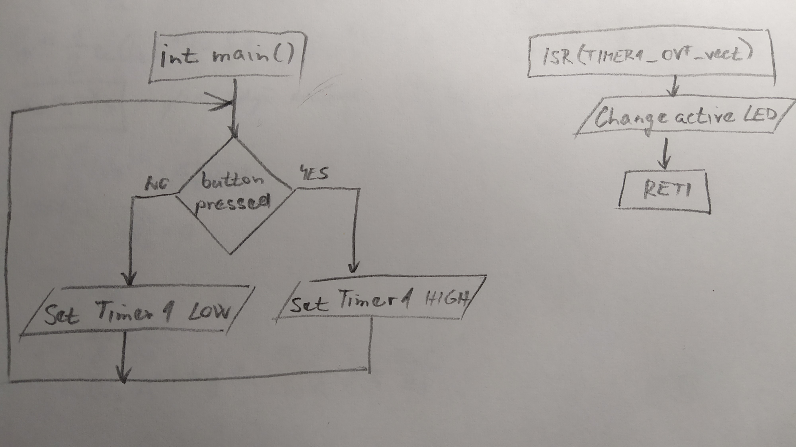
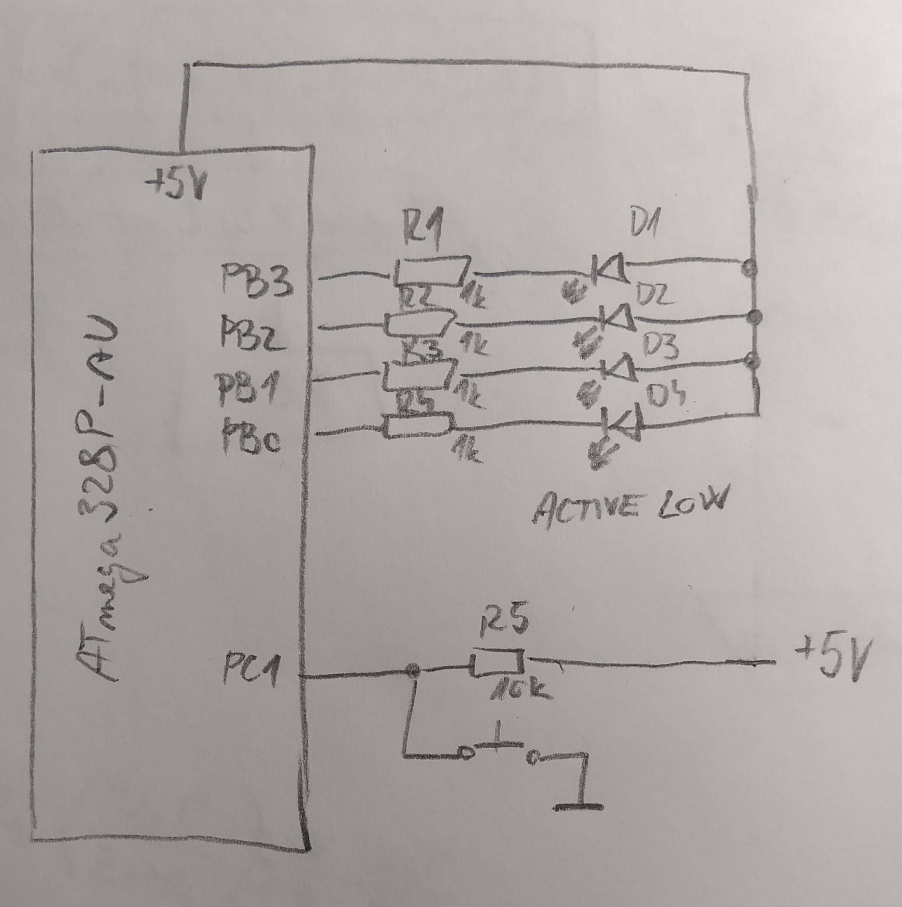

# Lab 4: Jakub Hlaváček

Link to your `Digital-electronics-2` GitHub repository:

   [https://github.com/Jakubhl](https://github.com/Jakubhl/Digital-electronics-2)

### Overflow times

1. Complete table with overflow times.

| **Module** | **Number of bits** | **1** | **8** | **32** | **64** | **128** | **256** | **1024** |
| :-: | :-: | :-: | :-: | :-: | :-: | :-: | :-: | :-: |
| Timer/Counter0 | 8  | 16u | 128u | -- | 1024u | -- | 4096u | 16384u |
| Timer/Counter1 | 16 | 4096u | 32768u | -- | 262144u | -- | 1048576u | 4194304u |
| Timer/Counter2 | 8  | 16u | 128u | 512u | 1024u | 2048u | 4096u | 16384u |


### Timer library

1. In your words, describe the difference between common C function and interrupt service routine.
   * Function
   * Interrupt service routine

2. Part of the header file listing with syntax highlighting, which defines settings for Timer/Counter0:

```c
/**
 * @name  Definitions of Timer/Counter0
 * @note  F_CPU = 16 MHz
 */
// WRITE YOUR CODE HERE
/** @brief Stop timer, prescaler 000 --> STOP */
#define TIM1_stop()           TCCR1B &= ~((1<<CS12) | (1<<CS11) | (1<<CS10));
/** @brief Set overflow 4ms, prescaler 001 --> 1 */
#define TIM1_overflow_4ms()   TCCR1B &= ~((1<<CS12) | (1<<CS11)); TCCR1B |= (1<<CS10);
/** @brief Set overflow 33ms, prescaler 010 --> 8 */
#define TIM1_overflow_33ms()  TCCR1B &= ~((1<<CS12) | (1<<CS10)); TCCR1B |= (1<<CS11);
/** @brief Set overflow 262ms, prescaler 011 --> 64 */
#define TIM1_overflow_262ms() TCCR1B &= ~(1<<CS12); TCCR1B |= (1<<CS11) | (1<<CS10);
/** @brief Set overflow 1s, prescaler 100 --> 256 */
#define TIM1_overflow_1s()    TCCR1B &= ~((1<<CS11) | (1<<CS10)); TCCR1B |= (1<<CS12);
/** @brief Set overflow 4s, prescaler // 101 --> 1024 */
#define TIM1_overflow_4s()    TCCR1B &= ~(1<<CS11); TCCR1B |= (1<<CS12) | (1<<CS10);
/** @brief Enable overflow interrupt, 1 --> enable */
#define TIM1_overflow_interrupt_enable()  TIMSK1 |= (1<<TOIE1);
/** @brief Disable overflow interrupt, 0 --> disable */
#define TIM1_overflow_interrupt_disable() TIMSK1 &= ~(1<<TOIE1);

/**
 * @name  Definitions for 8-bit Timer/Counter0
 * @note  t_OVF = 1/F_CPU * prescaler * 2^n where n = 8, F_CPU = 16 MHz
 */
/** @brief Stop timer, prescaler 000 --> STOP */
#define TIM0_stop()           TCCR0B &= ~((1<<CS12) | (1<<CS11) | (1<<CS10));
/** @brief Set overflow 16us, prescaler 001 --> 1 */
#define TIM0_overflow_16us()   TCCR0B &= ~((1<<CS12) | (1<<CS11)); TCCR0B |= (1<<CS10);
/** @brief Set overflow 128us, prescaler 010 --> 8 */
#define TIM0_overflow_128us()  TCCR0B &= ~((1<<CS12) | (1<<CS10)); TCCR0B |= (1<<CS11);
/** @brief Set overflow 1ms, prescaler 011 --> 64 */
#define TIM0_overflow_1ms() TCCR0B &= ~(1<<CS12); TCCR0B |= (1<<CS11) | (1<<CS10);
/** @brief Set overflow 4ms, prescaler 100 --> 256 */
#define TIM0_overflow_4ms()    TCCR0B &= ~((1<<CS11) | (1<<CS10)); TCCR0B |= (1<<CS12);
/** @brief Set overflow 16.3ms, prescaler // 101 --> 1024 */
#define TIM0_overflow_16ms()    TCCR0B &= ~(1<<CS11); TCCR0B |= (1<<CS12) | (1<<CS10);
/** @brief Enable overflow interrupt, 1 --> enable */
#define TIM0_overflow_interrupt_enable()  TIMSK0 |= (1<<TOIE0);
/** @brief Disable overflow interrupt, 0 --> disable */
#define TIM0_overflow_interrupt_disable() TIMSK0 &= ~(1<<TOIE0);

/**
 * @name  Definitions for 8-bit Timer/Counter2
 * @note  t_OVF = 1/F_CPU * prescaler * 2^n where n = 8, F_CPU = 16 MHz
 */
/** @brief Stop timer, prescaler 000 --> STOP */
#define TIM2_stop()           TCCR2B &= ~((1<<CS12) | (1<<CS11) | (1<<CS10));
/** @brief Set overflow 16us, prescaler 001 --> 1 */
#define TIM2_overflow_16us()   TCCR2B &= ~((1<<CS12) | (1<<CS11)); TCCR2B |= (1<<CS10);
/** @brief Set overflow 128us, prescaler 010 --> 8 */
#define TIM2_overflow_128us()  TCCR2B &= ~((1<<CS12) | (1<<CS10)); TCCR2B |= (1<<CS11);
/** @brief Set overflow 512us, prescaler 011 --> 32 */
#define TIM2_overflow_512us() TCCR2B &= ~(1<<CS12); TCCR2B |= (1<<CS11) | (1<<CS10);
/** @brief Set overflow 1ms, prescaler 100 --> 64 */
#define TIM2_overflow_1ms()    TCCR2B &= ~((1<<CS11) | (1<<CS10)); TCCR2B |= (1<<CS12);
/** @brief Set overflow 2ms, prescaler // 101 --> 128 */
#define TIM2_overflow_2ms()    TCCR2B &= ~(1<<CS11); TCCR2B |= (1<<CS12) | (1<<CS10);
/** @brief Set overflow 4ms, prescaler // 110 --> 256 */
#define TIM2_overflow_4ms()    TCCR2B &= ~(1<<CS10); TCCR2B |= (1<<CS12) | (1<<CS11);
/** @brief Set overflow 16.3ms, prescaler // 111 --> 1024 */
#define TIM2_overflow_16ms()    TCCR2B |= (1<<CS12) | (1<<CS11) | (1<<CS10);
/** @brief Enable overflow interrupt, 1 --> enable */
#define TIM2_overflow_interrupt_enable()  TIMSK2 |= (1<<TOIE2);
/** @brief Disable overflow interrupt, 0 --> disable */
#define TIM2_overflow_interrupt_disable() TIMSK2 &= ~(1<<TOIE2);

```

3. Flowchart figure for function `main()` and interrupt service routine `ISR(TIMER1_OVF_vect)` of application that ensures the flashing of one LED in the timer interruption. When the button is pressed, the blinking is faster, when the button is released, it is slower. Use only a timer overflow and not a delay library.

   


### Knight Rider

1. Scheme of Knight Rider application with four LEDs and a push button, connected according to Multi-function shield. Connect AVR device, LEDs, resistors, push button, and supply voltage. The image can be drawn on a computer or by hand. Always name all components and their values!

   
